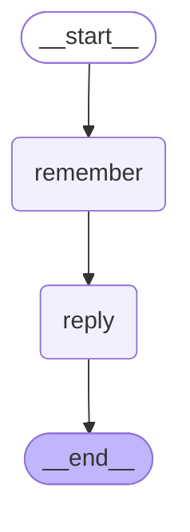

# Example 1 - a thread (remember -> reply)

```mermaid
---
config:
  flowchart:
    curve: linear
---
graph TD;
	__start__([<p>__start__</p>]):::first
	remember(remember)
	reply(reply)
	__end__([<p>__end__</p>]):::last
	__start__ --> remember;
	remember --> reply;
	reply --> __end__;
	classDef default fill:#f2f0ff,line-height:1.2
	classDef first fill-opacity:0
	classDef last fill:#bfb6fc

```
