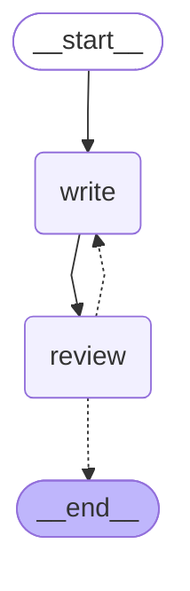

# Example 3 - the loop used for time travel

```mermaid
---
config:
  flowchart:
    curve: linear
---
graph TD;
	__start__([<p>__start__</p>]):::first
	write(write)
	review(review)
	__end__([<p>__end__</p>]):::last
	__start__ --> write;
	review -.-> __end__;
	review -.-> write;
	write --> review;
	classDef default fill:#f2f0ff,line-height:1.2
	classDef first fill-opacity:0
	classDef last fill:#bfb6fc

```
