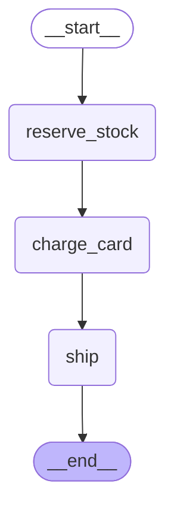

# Example 4 - the order pipeline (crash and resume)

```mermaid
---
config:
  flowchart:
    curve: linear
---
graph TD;
	__start__([<p>__start__</p>]):::first
	reserve_stock(reserve_stock)
	charge_card(charge_card)
	ship(ship)
	__end__([<p>__end__</p>]):::last
	__start__ --> reserve_stock;
	charge_card --> ship;
	reserve_stock --> charge_card;
	ship --> __end__;
	classDef default fill:#f2f0ff,line-height:1.2
	classDef first fill-opacity:0
	classDef last fill:#bfb6fc

```
